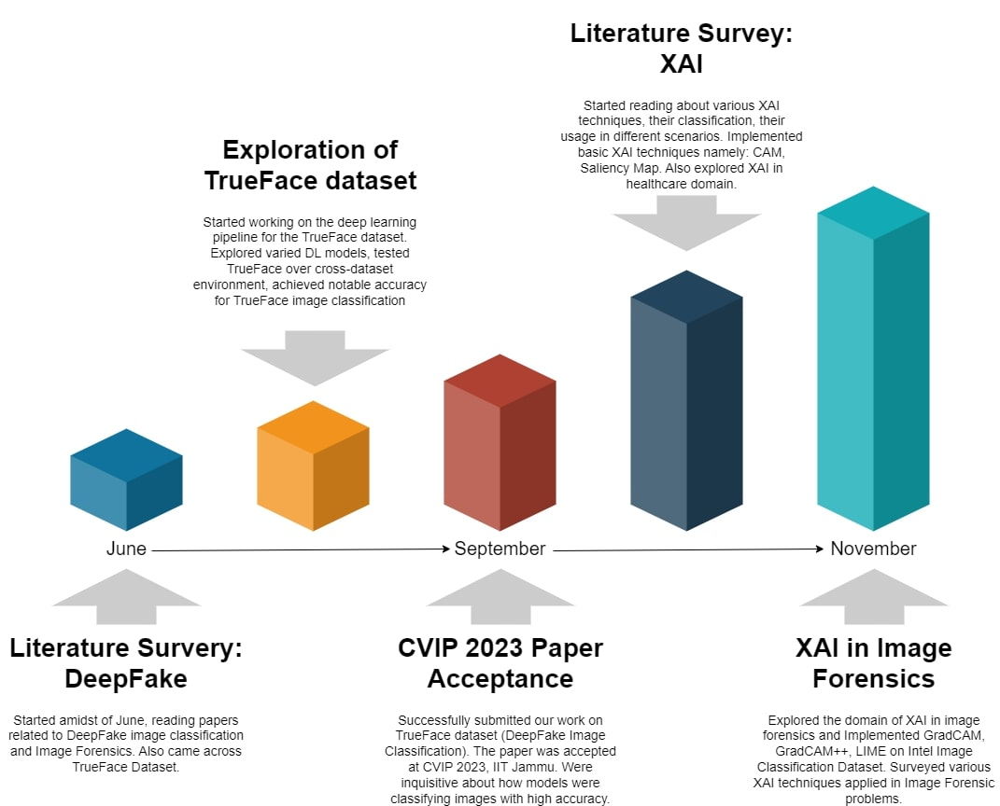

# Explainable AI for Image Forensics (Master's Thesis Project)

## Overview
This repository contains the code and documentation for my Master's Thesis Project focused on DeepFake image classification and Explainable AI (XAI) techniques. The project aims to develop accurate DeepFake image identification models and explore various XAI methods to interpret model behaviors and predictions.

## Key Features
- DeepFake image classification using tailored deep learning pipelines.
- Exploration of Explainable AI (XAI) methods, specifically focusing on Post-Hoc techniques.
- Implementation and analysis of Grad-CAM, CAM Saliency, SHAP, LIME, and other XAI techniques for model interpretability.
- Comprehensive evaluation of model behaviors and predictions in the context of DeepFake image identification.

## Progress Till Now

## Acknowledgments
- Acknowledgments: Acknowledgments to mentors, research advisors, and contributors for their support and guidance throughout this thesis project.

## Contact Information
For any inquiries or collaboration opportunities, please contact Protyay Dey via protyayofficial@gmail.com.

